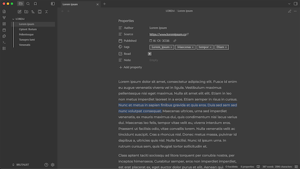
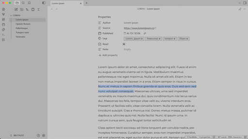

# Brutalist Theme for Obsidian
Compatible with Style Settings

**What is it?**

**Brutalist is a theme designed specifically for heavy readers and writers.**

Its stark, geometric aesthetics prioritise function and raw form over embellishment. The interface features a strictly angular, squared-off architecture, eliminating rounded corners for a precise, purposeful appearance. The colour scheme utilises low-contrast shades of grey and restrained accents, engineered to maintain focus and minimise visual strain during prolonged sessions. As the name suggests, the aesthetic derives from Brutalist architecture: honest, utilitarian, and bold.

**Design Philosophy**

The objective was to create a comfortable environment that facilitates focused reading and note creation through a low-distraction, text-centric interface. This aids deep work by removing visual clutter.

* **Dark Mode:** Inspired by dedicated reading applications such as Instapaper and Safari’s 'Reader View', the palette is calibrated for optimal comfort in low-light conditions.
* **Light Mode:** Offers a distinct alternative for those who prefer a brighter interface, whilst strictly adhering to the core principles of text primacy and minimal visual interruption.

**Who is this theme for?**

This theme is tailored for individuals who dedicate significant time to reading notes or drafting content within Obsidian. It is particularly effective for users leveraging the Obsidian Web Clipper to manage long-form articles, treating the vault as a reading repository. Similarly, it provides writers and coders with an immersive environment conducive to focused output.

## Customisation
You can tweak the following visual elements via the [**Style Settings**](https://github.com/mgmeyers/obsidian-style-settings) plugin:

* **Typography:** Customise fonts for the body and UI, and adjust line height.
* **Alignment:** Toggle between Justified text (default) and Left alignment.
* **Colours:** Change the specific accent colours for Light and Dark modes, and the text highlight colour.
* **Layout:** Adjust the maximum editor width.

## Gallery
### Dark Mode

### Light Mode
*Features distinct accents and clear visual hierarchy.*

## Installation

### Method 1: Community Themes
1. Open **Settings** > **Appearance**.
2. Click **Manage** under Themes.
3. Search for **Brutalist**.
4. Click **Install** and then **Use**.

### Method 2: Manual Installation
1. Download `theme.css` and `manifest.json` from this repository.
2. Move these files into your vault's hidden folder: `.obsidian/themes/Brutalist/`.
3. Reload Obsidian and select the theme.

---

Created by **DuckTapeKiller**
