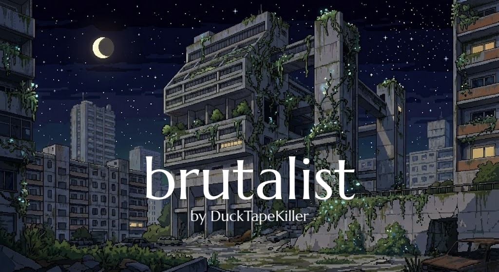
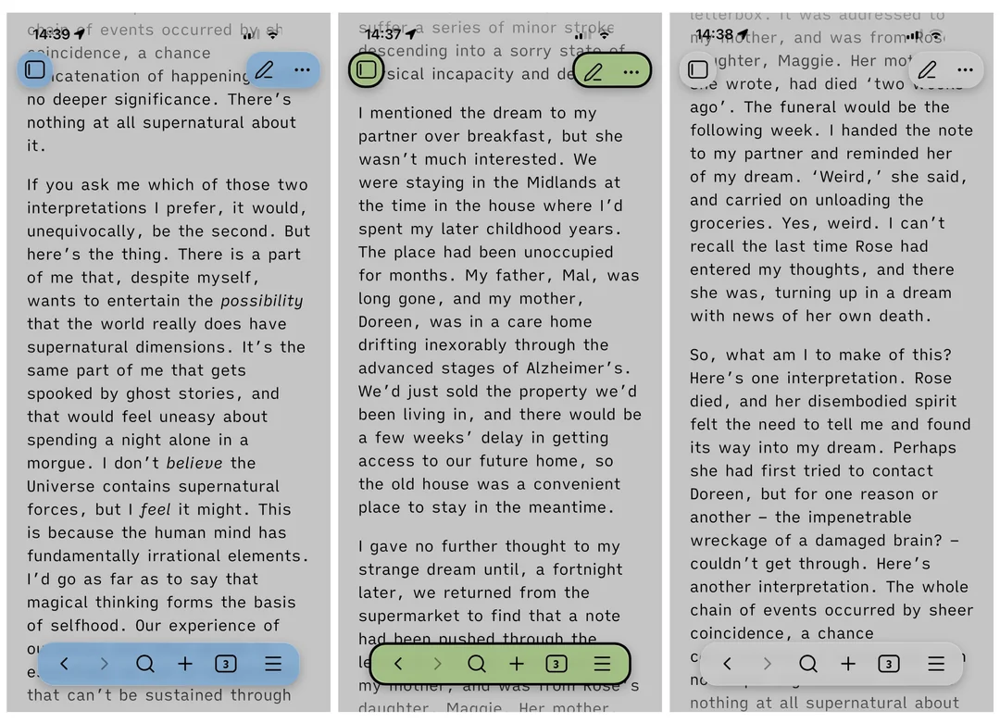
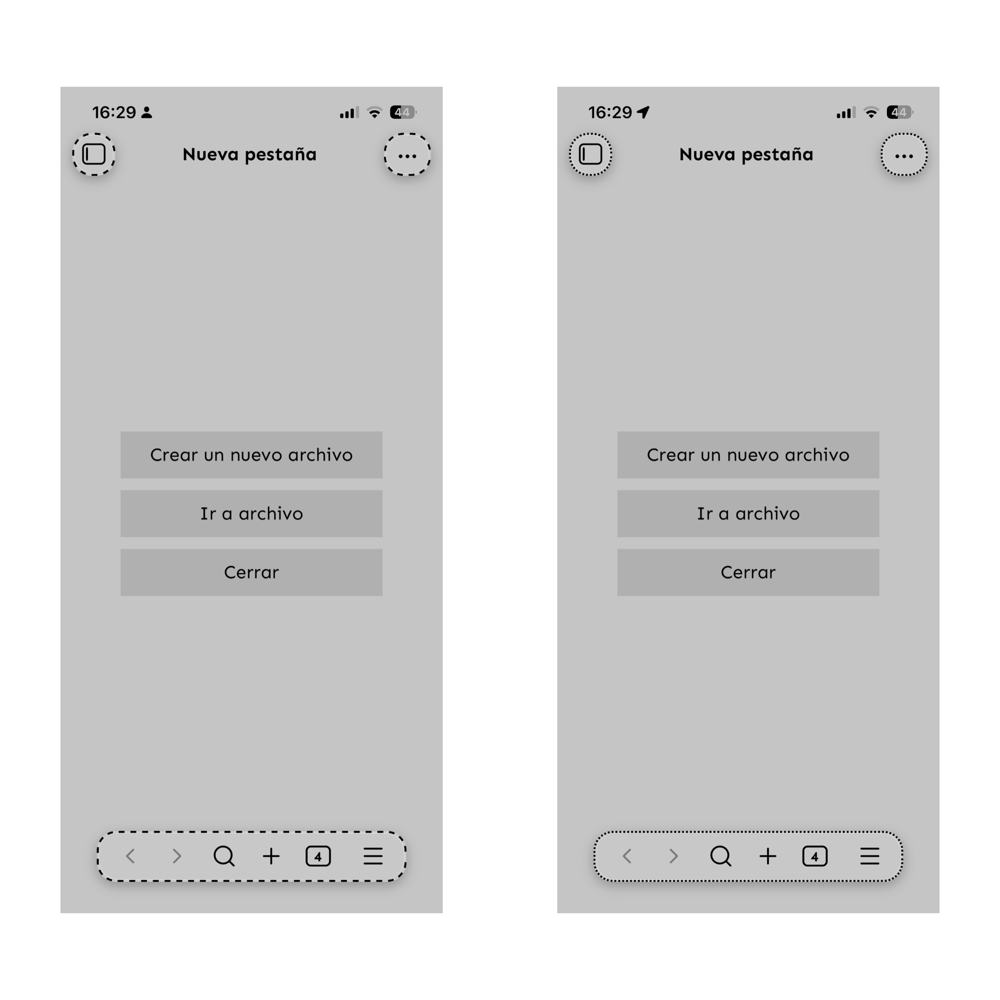
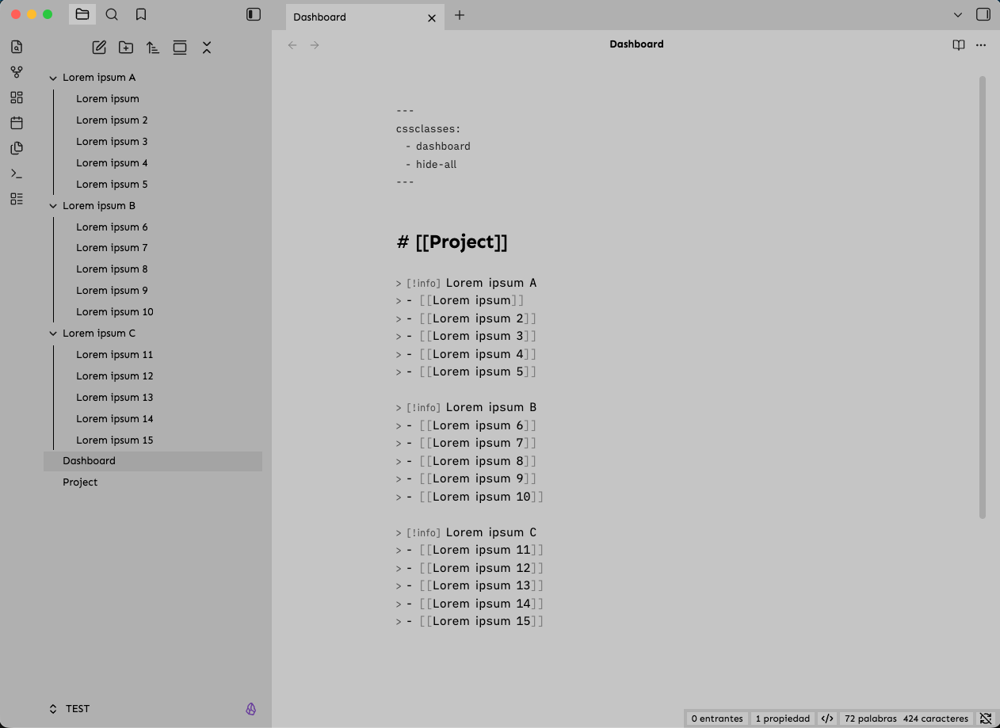
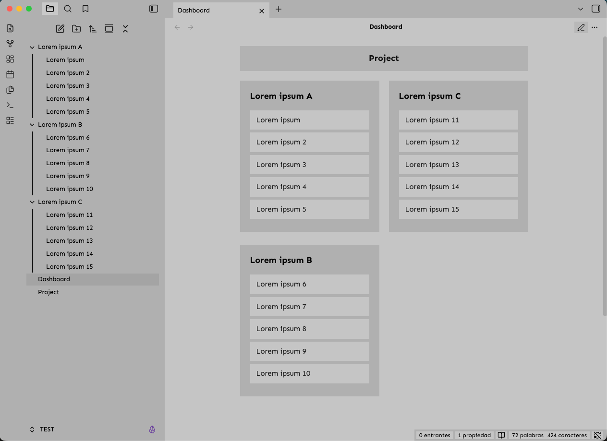
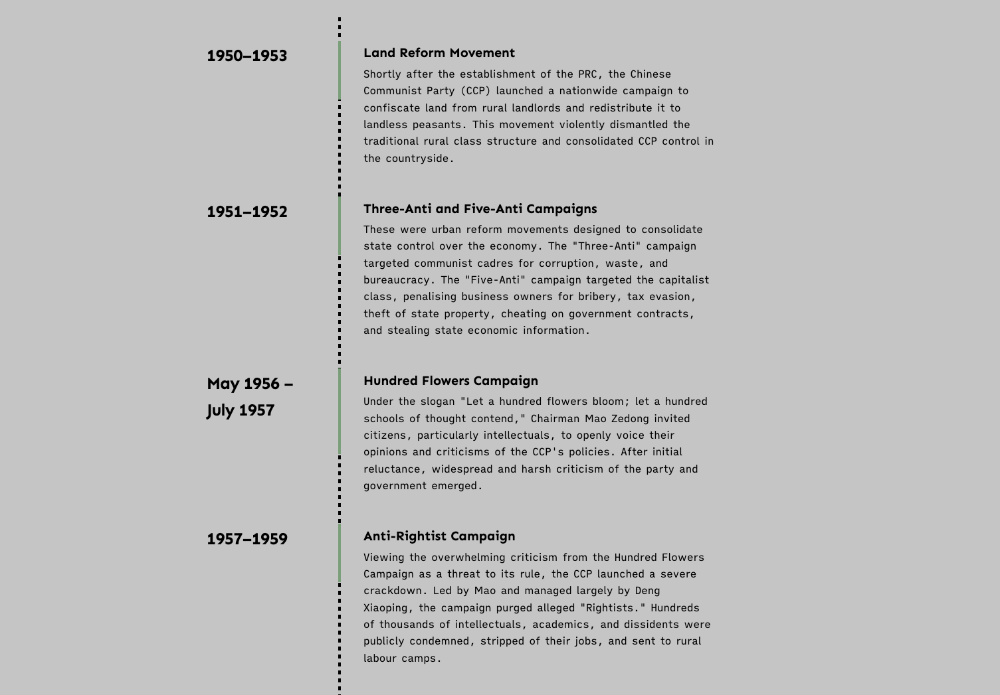
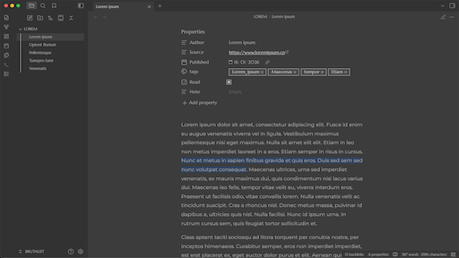
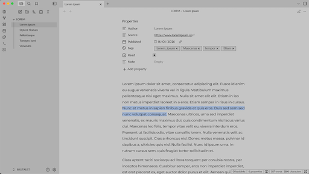

# A Theme for Obsidian
Compatible with Style Settings

[](https://ko-fi.com/ducktapekiller)



**What is it?**

**Brutalist is a theme designed specifically for heavy readers and writers.**

Its stark, geometric aesthetics prioritise function and raw form over embellishment. The interface features a strictly angular, squared-off architecture, eliminating rounded corners for a precise, purposeful appearance. The colour scheme utilises low-contrast shades of grey and restrained accents, engineered to maintain focus and minimise visual strain during prolonged sessions. As the name suggests, the aesthetic derives from Brutalist architecture: honest, utilitarian, and bold.

**Design Philosophy**

The objective was to create a comfortable environment that facilitates focused reading and note creation through a low-distraction, text-centric interface. This aids deep work by removing visual clutter.

* **Dark Mode:** Inspired by dedicated reading applications such as Instapaper and Safari’s “Reader View”, the palette is calibrated for optimal comfort in low-light conditions.
* **Light Mode:** Offers a distinct alternative for those who prefer a brighter interface, whilst strictly adhering to the core principles of text primacy and minimal visual interruption.

**Who is this theme for?**

This theme is tailored for individuals who dedicate significant time to reading notes or drafting content within Obsidian. It is particularly effective for users leveraging the Obsidian Web Clipper to manage long-form articles, treating the vault as a reading repository. Similarly, it provides writers with an immersive environment conducive to focused output.

## Customisation

There are two distinct methods for customising the theme: globally via the **Style Settings** plugin, or on a per-note basis using **cssclasses**. These methods can be combined.

### Global Configuration (Style Settings)

You can configure the following visual elements via the [**Style Settings**](https://github.com/mgmeyers/obsidian-style-settings) plugin:

* **Fonts:** Select distinct typefaces for the body text and the UI/headers (Default: Sen (UI) and iA Writer Quattro S (Body)).
* **Alignment:** Switch between Left Align (default) and Justified text.
* **Note Width Control:** Choose between different paragraph width options.
* **Line Height:** Assign a line spacing between 1.0 and 3.0.
* **Inline Title Size:** Adjust the size of the inline title relative to the text.
* **Auto-hide Side Ribbon:** Hides the left ribbon and only shows it on hover.
* **Mobile Settings:** Configuration for the mobile drawer and navigation bar.
* **Width Per-Note Overrides:** Use `cssclasses` to override global settings and apply specific widths to individual notes.
  * **Hide both front matter and note titles (per individual notes):** Ideal for Homepage or tables.
* **Dashboard & Masonry Layout System:** Create homepages and menus in your notes using either callouts or HTML.

### 1. Fonts

This theme contains the following typefaces:

### Serif

* **Hepta Slab** by Mike LaGoudy: [Source](https://fonts.google.com/specimen/Hepta+Slab)
* **Libre Baskerville** by Impallari Type: [Source](https://fonts.google.com/specimen/Libre+Baskerville)
* **Libre Caslon Text** by Impallari Type: [Source](https://fonts.google.com/specimen/Libre+Caslon+Text)
* **Marcellus** by Astigmatic: [Source](https://fonts.google.com/specimen/Marcellus)
* **Spectral** by Production Type: [Source](https://fonts.google.com/specimen/Spectral)

### Sans Serif

* **iA Writer Duo S** by Information Architects: [Source](https://github.com/iaolo/iA-Fonts)
* **iA Writer Quattro S** by Information Architects: [Source](https://github.com/iaolo/iA-Fonts)
* **Libre Franklin** by Impallari Type: [Source](https://fonts.google.com/specimen/Libre+Franklin)
* **Montserrat** by Julieta Ulanovsky, Sol Matas, Juan Pablo del Peral and Jacques Le Bailly: [Source](https://fonts.google.com/specimen/Montserrat)
* **Sen** by Kosal Sen: [Source](https://fonts.google.com/specimen/Sen)

### Monospace

* **iA Writer Mono S** by Information Architects: [Source](https://github.com/iaolo/iA-Fonts)
* **Noto Sans Mono** by Google: [Source](https://fonts.google.com/noto/specimen/Noto+Sans+Mono)
**Clarification:** Typefaces are embedded within the theme, ensuring they are available offline and on any device without requiring local installation.

On Style settings, you can chose any of these fonts for either Body or UI and Headers.

### 2. Alignment

You can modify the alignment of your notes. In **Style Settings**, simply display the dropdown menu and select between:

* Left aligned (default)
* Right aligned
* Centre aligned
* Justified

### 3. Note Width Control

By default, notes are restricted to a readable width (800px). You can force specific notes to use more horizontal space.

The available options are:

* 500px
* 600px (Default)
* 700px
* 800px
* 900px
* 1000px
* Wide (1200px)
* Full Width (100%)

> **Note on Mobile:** These width constraints apply to **Desktop** only. On mobile devices, the theme ignores these classes and fits content to the screen width.

### 4. Line Height

The theme defaults to a decimal line spacing of 1.5. You can adjust this value between 1.0 and 3.0 via the Style Settings slider.

### 5. Inline Title Size

Adjust the size of the inline title.
* **Range:** 1.0em to 5.0em (Default: 2em)

### 6. Auto-hide Side Ribbon

Toggle this option to hide the left ribbon interface. It will only appear when hovering over the left edge.

### 7. Mobile Settings

Settings for the Drawer and Navigation Bar.

**Drawer**
* **Light Mode:** Set background colour.
* **Dark Mode:** Set background colour.

**Navigation Bar**
Settings for both Light and Dark modes:
* **Border Thickness:** 0px - 10px.
* **Opacity:** 0.0 - 1.0.
* **Colour:** Set background colour.
* **Nav Bar Radius:** Adjust corner curvature (0px - 30px).





### 8. Width Per-Note Overrides

This feature is particularly useful for notes containing wide tables, although it can be applied to any note.

You can use the `cssclasses` property to override the global width settings for specific files. To set a custom width for a single note (and the tables within it), add one of the following classes to the **frontmatter**:

* `width-800`
* `width-900`
* `width-1000`
* `width-1200`
* `width-1600`

Example:

```yaml
---
cssclasses: width-1200
---
```
**Hide front matter or note titles (per individual notes):** You can hide any front matter and note title by simply adding this to your cssclasses:

```yaml
---
cssclasses: hide-all
---
```

### 9. Dashboard & Masonry Layout System

The theme allows you to organise your notes into a clean, visual grid. The system is highly versatile, supporting native **Obsidian Callouts**.

### 📋 Key Features
* **Masonry Layout:** Automatic column distribution (2 columns by default, 3 on wide screens, and 1 on mobile).
* **Hybrid Compatibility:** Works by either wrapping content, simply applying the CSS class to notes, or using standard Callouts.
* **Brutalist Aesthetic:** Sharp edges, zero border-radius, and high-contrast UI elements.


---

### 🛠️ How to Use

To activate the dashboard view, add `cssclasses: dashboard` to your note's Properties (YAML).

#### Option A: Using Callouts (Simple & Native)
Every Callout within a note using the `dashboard` class will automatically transform into a masonry card.

```markdown
---
cssclasses: dashboard
---

> [!info] My Card
> - [[Link 1]]
> - [[Link 2]]

```
Example:



Should look like this:



#### Create Dashboard Banners

Create a banner callout.

* **Full Customisation:** Integrated with *Style Settings* to adjust column widths and grid spacing.
* **Immersive Banners:** The banner now spans the entire width of the window, reaching all the way up to the tab header (removing the top margins).
* **Adjustable Height:** You can now control exactly how tall the banner is directly via Style Settings.
* **ard Positioning:** You can control the vertical offset of your dashboard cards. Pull them up to overlap the banner or push them down below it.
* **Transparency Control:** If you choose to overlap your cards with the banner, you can now adjust their transparency level in Style Settings. This creates a “frosted glass” effect, keeping the text readable while revealing the image behind it.
To add a banner, simply use:

```yaml
> [!banner]
> ![[your_banner.jpg]]
```

## **Important Considerations:**

* **Desktop Only:** This banner update applies strictly to the Desktop interface. On mobile, the banner is automatically hidden to save screen space.

* **Suggested plugin:** The banner is fixed and should remain so provided your dashboards are not too long. When they are long enough to require scrolling, the banner will disappear because the varying nature of Obsidian prevents it from remaining fixed. If you plan to use very tall cards or numerous cards, I therefore developed this ultra-minimalist plugin to make the banner permanently fixed and always visible: https://github.com/DuckTapeKiller/brutalist-persistent-banner

It should look like this:


### 10. CSS-Only Timelines

The theme features a native, CSS-only timeline layout that transforms standard bulleted lists into a professional split-view chronology without requiring any external plugins. To activate it, add `cssclasses: custom-timeline` to your note's frontmatter.

Structure your timeline as a single, continuous unordered list. Every event must consist of exactly three bullet points in this strict sequence: Date, Title, and Content. The theme will automatically remove the default bullet points, draw a vertical line, and format the items into a structured grid.

**Example:**

```markdown
---
cssclasses: custom-timeline
---

* 1950–1953
* Land Reform Movement
* Shortly after the establishment of the PRC, the Chinese Communist Party (CCP) launched a nationwide campaign to confiscate land from rural landlords and redistribute it to landless peasants.

* 1951–1952
* Three-Anti and Five-Anti Campaigns
* These were urban reform movements designed to consolidate state control over the economy...
```



## Gallery
### Dark Mode


### Light Mode
*Features distinct accents and clear visual hierarchy.*


## Installation

### Method 1: Community Themes
1. Open **Settings** > **Appearance**.
2. Click **Manage** under Themes.
3. Search for **Brutalist**.
4. Click **Install** and then **Use**.

### Method 2: Manual Installation
1. Download `theme.css` and `manifest.json` from this repository.
2. Move these files into your vault's hidden folder: `.obsidian/themes/Brutalist/`.
3. Reload Obsidian and select the theme.

---

_This theme is a perpetual work in progress._

Created by **DuckTapeKiller**
