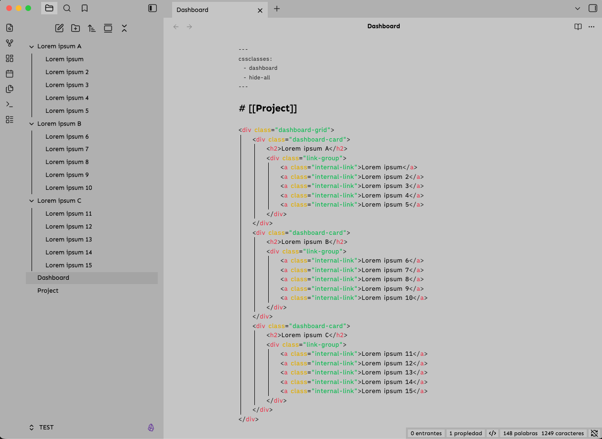
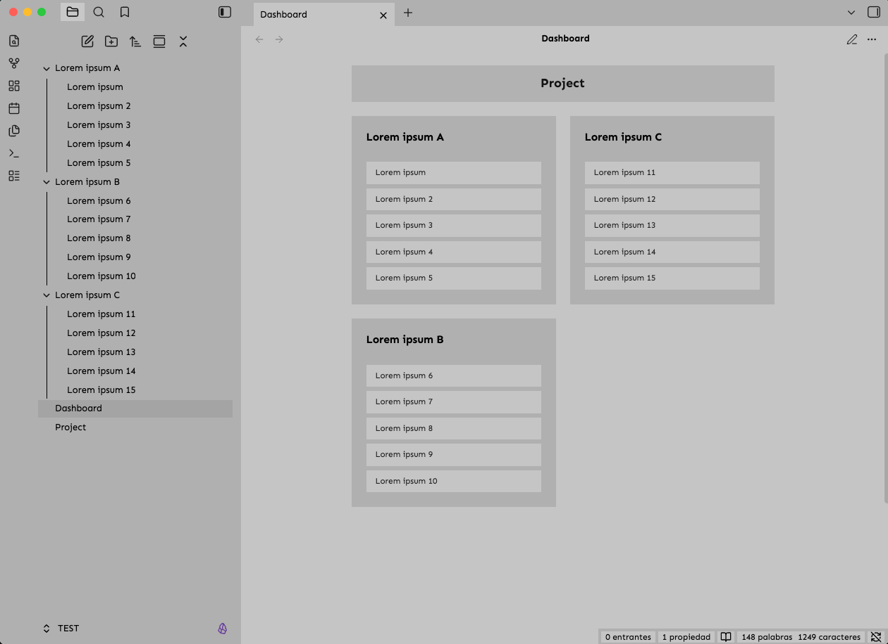

# Brutalist Theme for Obsidian
Compatible with Style Settings

[](https://ko-fi.com/ducktapekiller)


**What is it?**

**Brutalist is a theme designed specifically for heavy readers and writers.**

Its stark, geometric aesthetics prioritise function and raw form over embellishment. The interface features a strictly angular, squared-off architecture, eliminating rounded corners for a precise, purposeful appearance. The colour scheme utilises low-contrast shades of grey and restrained accents, engineered to maintain focus and minimise visual strain during prolonged sessions. As the name suggests, the aesthetic derives from Brutalist architecture: honest, utilitarian, and bold.

**Design Philosophy**

The objective was to create a comfortable environment that facilitates focused reading and note creation through a low-distraction, text-centric interface. This aids deep work by removing visual clutter.

* **Dark Mode:** Inspired by dedicated reading applications such as Instapaper and Safari’s 'Reader View', the palette is calibrated for optimal comfort in low-light conditions.
* **Light Mode:** Offers a distinct alternative for those who prefer a brighter interface, whilst strictly adhering to the core principles of text primacy and minimal visual interruption.

**Who is this theme for?**

This theme is tailored for individuals who dedicate significant time to reading notes or drafting content within Obsidian. It is particularly effective for users leveraging the Obsidian Web Clipper to manage long-form articles, treating the vault as a reading repository. Similarly, it provides writers with an immersive environment conducive to focused output.
## Customisation

There are two distinct methods for customising the theme: globally via the **Style Settings** plugin, or on a per-note basis using **cssclasses**. These methods can be combined.

### Global Configuration (Style Settings)

You can configure the following visual elements via the [**Style Settings**](https://github.com/mgmeyers/obsidian-style-settings) plugin:

* **Fonts:** Select distinct typefaces for the body text and the UI/headers (Default: Sen (UI) and iA Writter Quattro S (Body)).
* **Alignment:** Switch between Left Align (default) and Justified text.
* **Note Width Control:** Choose between different paragraph width options.
* **Line Height:** Assign a line spacing between 1.0 and 3.0. This provides options for vertical breathing room between lines.
* **Width Per-Note Overrides:** Ideal for tables. Use `cssclasses` to override global settings and apply specific widths to individual notes.
  * **Hide both front matter and note titles (per individual notes):** Ideal for Homepage or tables.

### 1. Fonts

This theme contains the following typefaces:

**iA Writer Family**

* **iA Writer Duo S**, **iA Writer Mono S**, and **iA Writer Quattro S** are sourced from the [iA-Fonts GitHub repository](https://github.com/iaolo/iA-Fonts).

**Google Fonts**

The following fonts are sourced from Google Fonts:

* **Literata** by TypeTogether: [Source](https://fonts.google.com/specimen/Literata)
* **Libre Baskerville** by Impallari Type: [Source](https://fonts.google.com/specimen/Libre+Baskerville)
* **Marcellus** by Astigmatic: [Source](https://fonts.google.com/specimen/Marcellus)
* **Montserrat** by Julieta Ulanovsky, Sol Matas, Juan Pablo del Peral and Jacques Le Bailly: [Source](https://fonts.google.com/specimen/Montserrat)
* **Noto Sans Mono** by Google: [Source](https://fonts.google.com/noto/specimen/Noto+Sans+Mono)
* **Sen** by Kosal Sen: [Source](https://fonts.google.com/specimen/Sen)
* **Spectral** by Production Type: [Source](https://fonts.google.com/specimen/Spectral)

**Clarification:** Typefaces are embedded within the theme, ensuring they are available offline and on any device without requiring local installation.

On Style settings, you can chose any of these fonts for either Body or UI and Headers.

### 2. Alignment

You can modify the alignment of your notes. In **Style Settings**, simply display the dropdown menu and select between:

* Left aligned (default)
* Justified

### 3. Note Width Control

By default, notes are restricted to a readable width (800px). You can force specific notes to use more horizontal space.

The available options are:

* 500px
* 600px (Default)
* 700px
* 800px
* 900px
* 1000px
* Wide (1200px)
* Full Width (100%)

> **Note on Mobile:** These width constraints apply to **Desktop** only. On mobile devices, the theme ignores these classes and fits content to the screen width.

### 4. Line Height

The theme defaults to a decimal line spacing of 1.5. You can adjust this value between 1.0 and 3.0 via the Style Settings slider to customise the vertical density of your text.

### 5. Width Per-Note Overrides

This feature is particularly useful for notes containing wide tables, although it can be applied to any note.

You can use the `cssclasses` property to override the global width settings for specific files. To set a custom width for a single note (and the tables within it), add one of the following classes to the **frontmatter**:

* `width-800`
* `width-900`
* `width-1000`
* `width-1200`
* `width-1600`

Example:

```yaml
---
cssclasses: width-1200
---
```
**Hide front matter or note titles (per individual notes):** You can hide any front matter and note title by simply adding this to your cssclasses:

```yaml
---
cssclasses: hide-all
---
```

### 6. Dashboard & Masonry Layout System

The theme allows you to organise your notes into a clean, visual grid. The system is highly versatile, supporting both native **Obsidian Callouts** and custom **HTML structures**.

### 📋 Key Features
* **Masonry Layout:** Automatic column distribution (2 columns by default, 3 on wide screens, and 1 on mobile).
* **Hybrid Compatibility:** Works by either wrapping content in HTML containers or simply applying the CSS class to notes using standard Callouts.
* **Brutalist Aesthetic:** Sharp edges, zero border-radius, and high-contrast UI elements.
* **Full Customisation:** Integrated with *Style Settings* to adjust column widths and grid spacing.

---

### 🛠️ How to Use

To activate the dashboard view, add `cssclasses: dashboard` to your note's Properties (YAML).

#### Option A: Using Callouts (Simple & Native)
Every Callout within a note using the `dashboard` class will automatically transform into a masonry card.

```
---
cssclasses: dashboard
---
# [Dashboard Title](Link)

> [!info] My Card
> - [[Link 1]]
> - [[Link 2]]

```
Example:


Should look like this:


#### Option B: Using HTML (Advanced Control)

Ideal for complex layouts or if you prefer to avoid Callout syntax.

```
---
cssclasses: dashboard
---
<div class="dashboard-grid">
    <div class="dashboard-card">
        <h2>HTML Card Title</h2>
        <div class="link-group">
            <a class="internal-link">Link 1</a>
            <a class="internal-link">Link 2</a>
        </div>
    </div>
</div>
```
Example:



It should look like this:




## Gallery
### Dark Mode


### Light Mode
*Features distinct accents and clear visual hierarchy.*


## Installation

### Method 1: Community Themes
1. Open **Settings** > **Appearance**.
2. Click **Manage** under Themes.
3. Search for **Brutalist**.
4. Click **Install** and then **Use**.

### Method 2: Manual Installation
1. Download `theme.css` and `manifest.json` from this repository.
2. Move these files into your vault's hidden folder: `.obsidian/themes/Brutalist/`.
3. Reload Obsidian and select the theme.


---

_This theme is a perpetual work in progress._

Created by **DuckTapeKiller**
