# Brutalist: A Theme for Obsidian
[](https://github.com/DuckTapeKiller/Brutalist/stargazers)
[](https://github.com/DuckTapeKiller/Brutalist/issues)
[](https://github.com/DuckTapeKiller/Brutalist/issues?q=is%3Aissue+is%3Aclosed)
[](https://github.com/DuckTapeKiller/Brutalist/blob/main/manifest.json)
[](https://github.com/DuckTapeKiller/Brutalist/releases)


Compatible with Style Settings.

[](https://ko-fi.com/ducktapekiller)

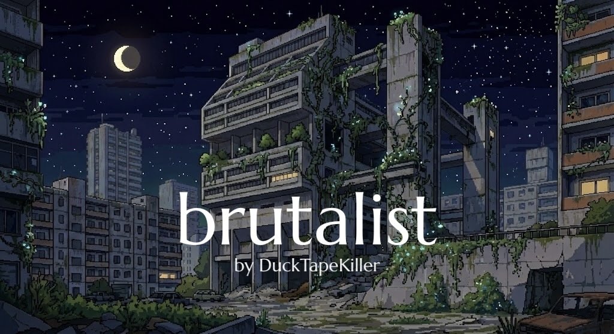

Brutalist is a calm, square-cornered theme for people who spend long hours reading and writing in Obsidian. It comes with six colour presets, card-based dashboards, image grids, timelines, Mermaid diagrams drawn in the theme's own colours, tidy PDF exports and a few quiet writing aids, and most of it can be adjusted from Style Settings. This guide walks you through all of it.

## Table of Contents

1. [Introduction](#1-introduction)
2. [Installation](#2-installation)
    1. [Installing the theme](#21-installing-the-theme)
    2. [Style Settings](#22-style-settings)
3. [Colour Presets](#3-colour-presets)
    1. [The six presets](#31-the-six-presets)
    2. [What a preset changes](#32-what-a-preset-changes)
    3. [Amber, Reader and Asphalt](#33-amber-reader-and-asphalt)
4. [Typography](#4-typography)
    1. [Fonts](#41-fonts)
    2. [Font and link colours](#42-font-and-link-colours)
5. [Page Layout](#5-page-layout)
6. [Headings and the Editor](#6-headings-and-the-editor)
    1. [Heading size scale](#61-heading-size-scale)
    2. [Numbered headings](#62-numbered-headings)
    3. [Highlight current line](#63-highlight-current-line)
7. [Per-Note Classes](#7-per-note-classes)
8. [Dashboards](#8-dashboards)
    1. [Making a dashboard](#81-making-a-dashboard)
    2. [How the cards are laid out](#82-how-the-cards-are-laid-out)
    3. [Groups of cards](#83-groups-of-cards)
    4. [Links as buttons](#84-links-as-buttons)
    5. [Banner](#85-banner)
    6. [Dashboard settings](#86-dashboard-settings)
    7. [Good to know](#87-good-to-know)
9. [Image Grid](#9-image-grid)
10. [Timelines](#10-timelines)
11. [Callouts](#11-callouts)
12. [Alternative Tasks](#12-alternative-tasks)
13. [Mermaid Diagrams](#13-mermaid-diagrams)
    1. [What Mermaid is](#131-what-mermaid-is)
    2. [Your first diagram](#132-your-first-diagram)
    3. [Flowcharts](#133-flowcharts)
    4. [Sequence diagrams](#134-sequence-diagrams)
    5. [Class diagrams](#135-class-diagrams)
    6. [State diagrams](#136-state-diagrams)
    7. [Other diagram types](#137-other-diagram-types)
    8. [How Brutalist draws diagrams](#138-how-brutalist-draws-diagrams)
    9. [Tips and troubleshooting](#139-tips-and-troubleshooting)
14. [Embedded Notes](#14-embedded-notes)
15. [Image Captions](#15-image-captions)
16. [Tables and Bases](#16-tables-and-bases)
17. [Tags, Links and the Interface](#17-tags-links-and-the-interface)
18. [Print and PDF Export](#18-print-and-pdf-export)
19. [Reduced Motion](#19-reduced-motion)
20. [Mobile](#20-mobile)
21. [Fine-Tuning with CSS Snippets](#21-fine-tuning-with-css-snippets)
22. [Known Limitations](#22-known-limitations)
23. [Gallery](#23-gallery)
24. [Quick Reference](#24-quick-reference)
25. [Credits and Support](#25-credits-and-support)

## 1. Introduction

**What is it?**

Brutalist is a theme for heavy readers and writers. Its stark, geometric look puts function and raw form ahead of decoration: every corner is square, borders are rare, and colour is used sparingly so the text always comes first. The aesthetic borrows from Brutalist architecture: honest, utilitarian and bold.

**Design philosophy**

The aim is a comfortable, low-distraction place to read and write, where the interface steps back and your text takes the lead.

* **Dark mode** takes its cue from dedicated reading apps such as Instapaper and Safari's Reader View, with warm, low-glare tones made for long sessions in dim light.
* **Light mode** is brighter, but follows the same principle of putting the text first.
* **Colour presets** keep the Brutalist structure while changing its mood, from the original concrete greys to deep blue, earthy green, warm sunset tones, an amber terminal or newspaper paper.

**Who is it for?**

Anyone who spends a lot of time reading or drafting inside Obsidian. It works especially well if you use the Obsidian Web Clipper to save long articles and treat your vault as a reading library.

**What's inside**

* Six colour presets, each with a light and a dark version ([§3](#3-colour-presets))
* Eight bundled typefaces and full control over font and link colours ([§4](#4-typography))
* Heading size scales, numbered headings and a current-line highlight ([§6](#6-headings-and-the-editor))
* Dashboards that turn callouts into a board of cards ([§8](#8-dashboards))
* Image grids ([§9](#9-image-grid)) and timelines ([§10](#10-timelines))
* Callouts coloured to suit your preset ([§11](#11-callouts)) and alternative task checkboxes ([§12](#12-alternative-tasks))
* Mermaid diagrams drawn in the theme's colours ([§13](#13-mermaid-diagrams))
* Clean, printer-friendly PDF export ([§18](#18-print-and-pdf-export))
* Respect for your system's reduced-motion setting ([§19](#19-reduced-motion))
* A customisable mobile navigation bar and drawer ([§20](#20-mobile))

## 2. Installation

### 2.1 Installing the theme

**From the Community Themes browser (recommended)**

1. Open **Settings › Appearance**.
2. Under **Themes**, click **Manage**.
3. Search for **Brutalist**.
4. Click **Install and use**.

**Manually**

1. Download `theme.css` and `manifest.json` from the [latest release](https://github.com/DuckTapeKiller/Brutalist/releases/latest).
2. In your vault, open the hidden `.obsidian` folder, then the `themes` folder inside it (create it if it isn't there), and make a new folder called `Brutalist`. Put both files in it, so you end up with `.obsidian/themes/Brutalist/theme.css` and `.obsidian/themes/Brutalist/manifest.json`.
3. Restart Obsidian, then choose **Brutalist** in **Settings › Appearance › Themes**.

> [!TIP]
> On macOS, press <kbd>Cmd</kbd> + <kbd>Shift</kbd> + <kbd>.</kbd> in Finder to show hidden folders such as `.obsidian`.

Brutalist needs Obsidian 1.13.0 or later. Its typefaces are embedded in `theme.css`, so they work offline and there's nothing else to install.

### 2.2 Style Settings

Most of Brutalist's options live in the free [Style Settings](https://github.com/mgmeyers/obsidian-style-settings) plugin. To install it, open **Settings › Community plugins**, click **Browse**, search for **Style Settings**, then click **Install** and **Enable**. Open **Settings › Style Settings** and you'll find five Brutalist sections:

| Section | What you'll find there |
| :--- | :--- |
| **Colour Presets** | The six palettes ([§3](#3-colour-presets)) |
| **Typography & Typeface** | Fonts, font colours and link colours ([§4](#4-typography)) |
| **Page Layout & Geometry** | Note width, alignment, line height, the note title, the ribbon and long properties ([§5](#5-page-layout)), plus **Editor & Headings** ([§6](#6-headings-and-the-editor)) |
| **Dashboard Layout Settings** | Card width, spacing and transparency, and the banner ([§8](#8-dashboards)) |
| **Mobile Settings** | The side drawer and the navigation bar ([§20](#20-mobile)) |

Every option has a button beside it that restores its default.

Brutalist works without Style Settings too: you simply get the defaults described in this guide. The one exception is the auto-hiding ribbon, which only switches on once Style Settings is installed.

## 3. Colour Presets

A colour preset repaints the whole app in one go: the page, sidebars, menus, code blocks, selections, highlights and the accent colour, as well as callouts, tags and several kinds of link. Choose one in **Style Settings › Colour Presets › Colour Preset**. Every preset has a light and a dark version, and Obsidian picks between them according to **Settings › Appearance › Base color scheme**.

### 3.1 The six presets

The *accent* in this table is the colour of switched-on toggles, sliders and similar highlights.

| Preset | Mood | Light mode: page · sidebar · accent | Dark mode: page · sidebar · accent |
| :--- | :--- | :--- | :--- |
| **Asphalt** (default) | The original Brutalist: concrete greys, with an orange accent in light mode and teal in dark mode | `#C5C5C5` · `#B0B0B0` · `#FF7700` | `#3C3C3C` · `#323232` · `#448494` |
| **Ocean** | Deep blue | `#CDEAFE` · `#A5D6FF` · `#2196F3` | `#1A2A3A` · `#0F1E2B` · `#64B5F6` |
| **Forest** | Earthy green | `#E8F5E9` · `#C8E6C9` · `#4CAF50` | `#1C2A22` · `#0F1A14` · `#81C784` |
| **Sunset** | Warm orange and pink | `#FFF3E0` · `#FFCCBC` · `#FF5722` | `#2A1F1A` · `#1A120E` · `#FF8A65` |
| **Amber** | An IBM amber-screen terminal | `#FFB000` · `#CC8E00` · `#332300` | `#050505` · `#000000` · `#FFB000` |
| **Reader** | Newspaper: paper white and ink grey | `#F5F5F0` · `#E8E8E0` · `#666666` | `#2A2A28` · `#1E1E1C` · `#A0A0A0` |

### 3.2 What a preset changes

* **Backgrounds:** the page, sidebars, modals, code blocks and unchecked checkboxes (and, in light mode, text fields and buttons), plus the *surface* colour shared by menus, tables, embedded notes and highlight bands.
* **Selection and highlights:** the colour of selected text and of `==highlighted==` text.
* **The accent:** switched-on toggles, sliders, active search options, the "Active" badge in the theme and plugin lists, the background of a tag under your pointer, and the dots on timelines.
* **Hover colour:** file rows, tabs, menu items, suggestions, settings rows, status bar items and the actions on the new tab page.
* **Scrollbars:** the thumbs take a tint of the accent.
* **Callouts:** each type gets its own clear hue, tuned to stay readable on that preset ([§11](#11-callouts)).
* **Tags and pills:** accent-coloured text on a light tint of the accent, both for tags in your notes and for the pills in Properties and Bases.
* **Links:** external links, footnote links and unresolved links take a shade of the accent, unless you've picked your own colour for them ([§4.2](#42-font-and-link-colours)).
* **Calendar plugin:** today's date and the dots that mark days with notes.

A preset leaves your font colours and your internal link colour alone: those always come from **Typography & Typeface**, except on Amber.

On the five coloured presets, the text of callouts, tags, links, the calendar's today and hovered rows reaches a contrast of at least 4.5:1 (the WCAG AA level) in both modes, with the default font colours. If you choose different font colours, it's worth a quick look to make sure everything still reads comfortably.

### 3.3 Amber, Reader and Asphalt

* **Amber** imitates a one-colour terminal, so it sets the font and link colours as well: black and charcoal on amber in light mode, amber on near-black in dark mode. While Amber is selected, the font and link colour pickers in Typography & Typeface have no effect; your choices come back as soon as you switch to another preset. Its dark-mode selection is a deep brown, so amber text stays legible on it.
* **Reader** uses grey as its accent, so toggles, tags and links stay neutral. Pick it if you want the feel of paper without any colour.
* **Asphalt** is Brutalist as it has always been: muted callout colours made for a grey page, neutral tags, Obsidian's grey hover, rust and teal external links, and scrollbars in the UI font colour.

## 4. Typography

### 4.1 Fonts

Choose three typefaces in **Style Settings › Typography & Typeface**:

| Setting | Used for | Choices | Default |
| :--- | :--- | :--- | :--- |
| **Body Font** | The text of your notes | iA Writer Quattro S, Montserrat, Sen *(sans serif)*; IBM Plex Serif, Ibarra Real Nova, Lora *(serif)*; Space Mono *(monospace)* | Lora |
| **Interface Font** | Everything else: sidebars, tabs, menus, settings, properties, the note title, headings, tags, captions and dashboard cards | Sen, Montserrat, iA Writer Quattro S, IBM Plex Serif, Ibarra Real Nova, Lora, Marcellus, Space Mono | Marcellus |
| **Monospace Font** | Code blocks and inline code | Noto Sans Mono, Space Mono | Noto Sans Mono |

Headings are set in the interface font at a regular weight. That pairing is a big part of Brutalist's character: your writing reads like a book, while titles and structure share the voice of the interface.

Every typeface above is embedded in the theme except Noto Sans Mono. If Noto Sans Mono isn't installed on your device, code falls back to your system's monospace font; install it, or choose Space Mono, for a consistent look.

### 4.2 Font and link colours

The same section has a group of colour settings for light mode and another for dark mode:

| Setting | What it colours | Light mode default | Dark mode default |
| :--- | :--- | :--- | :--- |
| **UI Font Colour** | The interface, headings, the note title and secondary text | `#222222` | `#C8BC9F` (Everforest) |
| **Body Font Colour** | The text of your notes | `#000000` | `#B0A589` (Dark Everforest) |
| **Internal Link Colour** | Links to other notes | The UI font colour | The UI font colour |
| **External Link Colour** | Links to websites | Rust `#A34100` on Asphalt; a shade of the accent on other presets | Teal `#7BB3C0` on Asphalt; a shade of the accent on other presets |
| **Footnote Link Colour** | Footnote numbers and their back-links | `#BD4B00` on Asphalt; a shade of the accent on other presets | `#7BB3C0` on Asphalt; a shade of the accent on other presets |

The two font colours are picked from a short list: greys down to pure black for light mode, and greys, pure white and three warm "Everforest" tones for dark mode. The three link colours are free colour pickers. A link colour you choose wins on every preset except Amber; restore its default to let the preset decide again.

## 5. Page Layout

These live in **Style Settings › Page Layout & Geometry**:

| Setting | What it does | Options | Default |
| :--- | :--- | :--- | :--- |
| **Book Style Paragraphs** | In reading view, removes the gap between paragraphs and indents the first line of each one instead, like a printed book. Paragraphs inside quotes aren't indented. | On or off | Off |
| **Note Width** | The maximum width of your text | 500, 600, 700, 800, 900, 1000 or 1200px, or full width | 600px |
| **Text Alignment** | How paragraphs line up, in reading view and in the editor | Left, justified, centred or right | Left |
| **Note Title Alignment** | Where the title at the top of each note sits | Left, centre or right | Centre |
| **Inline Title Size** | How big that title is | 1 to 5em | 3em |
| **Auto-hide Side Ribbon** | On desktop, the ribbon on the left shrinks to a slim strip and slides open when your pointer reaches it | On or off | On |
| **Line Height** | The space between lines of text | 1.0 to 3.0 | 1.7 |
| **Auto-expand Long Text Properties** | Shows long text properties in full, instead of cutting them off after a few lines | On or off | Off |

> [!NOTE]
> Note Width, and the width classes in [§7](#7-per-note-classes), apply while Obsidian's **Settings › Editor › Readable line length** is on, which is Obsidian's default. Turn it off and notes fill the whole pane. Widths apply on screens at least 768px wide; on a phone, text simply fits the screen.

The **Editor & Headings** group at the bottom of this section is covered next.

## 6. Headings and the Editor

### 6.1 Heading size scale

**Heading Size Scale** sets how much bigger each heading level is than body text, in reading view and in the editor:

| Level | Obsidian Default | Compact | Large |
| :--- | :---: | :---: | :---: |
| Heading 1 | 1.618em | 1.3em | 2.2em |
| Heading 2 | 1.462em | 1.22em | 1.85em |
| Heading 3 | 1.318em | 1.15em | 1.55em |
| Heading 4 | 1.188em | 1.1em | 1.3em |
| Heading 5 | 1.076em | 1.05em | 1.12em |
| Heading 6 | 1em | 1em | 1em |

**Compact** suits dense reference notes and outlines; **Large** gives long-form writing a more dramatic hierarchy.

### 6.2 Numbered headings

Switch on **Numbered Headings** and Brutalist numbers your headings like a report or a thesis. A level-one heading is treated as a title and left alone; levels two to six are numbered:

```markdown
# On Bridges            →  On Bridges
## History              →  1. History
### Roman arches        →  1.1. Roman arches
### Iron and steel      →  1.2. Iron and steel
## Design               →  2. Design
### Loads               →  2.1. Loads
#### Wind               →  2.1.1. Wind
```

A few things worth knowing:

* The numbers are drawn by the theme, not typed into your note. Your Markdown stays untouched, and turning the setting off removes them.
* They appear in the faint text colour, in reading view, in the editor and in PDF exports.
* Level-one headings don't restart the count. A note split into several `#` parts keeps numbering its `##` headings straight through: 1 and 2 in the first part, 3 and 4 in the next.
* If you skip a level, the missing one shows as a zero: a `####` directly under a `##` is numbered `1.0.1.`
* **Long notes:** Obsidian only keeps the part of a long note near the screen loaded, and the theme can only count headings that are loaded. Scroll far enough down a long note and the numbering starts again from the headings still loaded. Short and medium notes number correctly, and a PDF export, which renders the whole note at once, is always correct.

### 6.3 Highlight current line

**Highlight Current Line** draws a band in the surface colour behind the line your cursor is on, so you never lose your place while editing. It follows your preset, only appears in the editor (not in reading view), and selected text stays clearly visible on top of it.

## 7. Per-Note Classes

Some features are switched on for a single note by adding a class to its properties. Add a `cssclasses` property, either in the Properties panel or straight into the frontmatter, and list the classes you want:

```yaml
---
cssclasses:
  - dashboard
  - hide-all
  - width-1200
---
```

You can combine as many as you like.

| Class | What it does |
| :--- | :--- |
| `width-800`, `width-900`, `width-1000`, `width-1200`, `width-1600` | Makes this note 800, 900, 1000, 1200 or 1600px wide, whatever the global Note Width |
| `full-width` | Lets this note fill the whole pane |
| `hide-all` | Hides the properties block and the inline title, which is ideal for homepages, dashboards and other notes where you only want the content. The properties are still there, and you can edit them from the Properties view in the sidebar. |
| `dashboard` | Turns callouts into a board of cards ([§8](#8-dashboards)) |
| `img-grid` | Gathers consecutive images into a grid ([§9](#9-image-grid)) |
| `custom-timeline` | Turns a list into a timeline ([§10](#10-timelines)) |

Like Note Width, the width classes take effect on screens at least 768px wide while Readable line length is on. Dashboards are the exception: they respect their width class either way.

## 8. Dashboards

A dashboard turns an ordinary note into a board of cards: a homepage, a reading hub, a project overview. Every callout in the note becomes a card, so everything you already know about callouts still applies.

### 8.1 Making a dashboard

1. Add the `dashboard` class to the note. `hide-all` makes a good companion, and a width class gives the cards room to spread out.
2. Write one callout per card. A list of links makes a neat column of buttons.
3. Switch to reading view.

```markdown
---
cssclasses:
  - dashboard
  - hide-all
  - width-1200
---

> [!note] Reading
> - [[The Death of the Author]]
> - [[Ways of Seeing]]

> [!tip] Projects
> - [[Thesis outline]]
> - [[Conference talk]]

> [!example] Reference
> - [[Style guide]]
> - [Obsidian Help](https://help.obsidian.md)
```

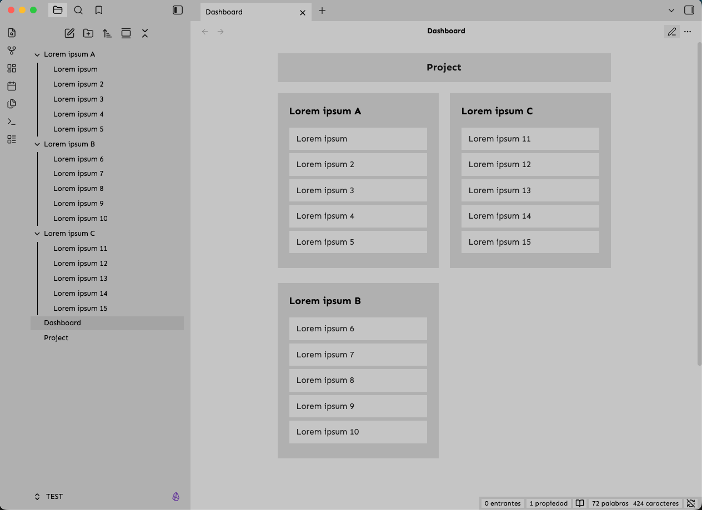

The callout type doesn't change how a card looks, since every card shares the same style. Use whichever type you like, even one you invent, such as `> [!card]`.

### 8.2 How the cards are laid out

* Every card is exactly as wide as **Card Width** (300px by default).
* Cards flow into columns and keep their natural height, so a short card never leaves a hole next to a long one.
* The dashboard uses as many columns as fit, and the whole block of cards is centred in the note.
* **Card Spacing** sets the space between cards, across and down alike.
* When there are only a few cards, they sit side by side in the middle instead of crowding into the left-hand columns.

**Give your dashboard room.** A dashboard lives inside the note's width like everything else, so at the default Note Width of 600px there's only room for one 300px card per row. Add a width class to let it spread out: in a wide enough window, `width-1200` fits three cards side by side, and `full-width` fits as many as the window allows. If you've turned Readable line length off, a dashboard without a width class spreads up to 1400px.

### 8.3 Groups of cards

Headings and text between callouts stretch across the full width and start a new group, which is a nice way to organise a busy dashboard. Each group lays out its own cards, and the dashboard is as wide as its largest group.

```markdown
## Today

> [!note] Journal
> - [[Daily note]]

> [!tip] Tasks
> - [[Inbox]]

## Library

A few things I'm reading at the moment.

> [!example] Books
> - [[Reading list]]
```

### 8.4 Links as buttons

Inside a card, a list item holding a link becomes a full-width button. On desktop a button inverts its colours, turns bold and nudges to the right when you hover over it; on a touchscreen it inverts while you press it. Links to notes and links to websites both work. Card titles use the interface font, and callout icons are hidden to keep the cards clean.

### 8.5 Banner

A banner places a large image across the top of a dashboard, with the cards floating over it:

```markdown
> [!banner]
> ![[my-banner.jpg]]
```

* Put the banner at the very top of the note, directly above your first cards.
* The image stretches across the top of the note and fades out towards the bottom.
* **Card Transparency** lets the banner show through the cards, with a soft blur for a frosted-glass effect.
* The banner isn't counted as a card and doesn't take up a column.
* Banners are a desktop feature: they're hidden on phones and tablets, and left out of PDF exports.

The banner is fixed in place. For dashboards that need scrolling, the [Brutalist Persistent Banner](https://github.com/DuckTapeKiller/brutalist-persistent-banner) plugin is recommended to keep it permanently visible.


### 8.6 Dashboard settings

These live in **Style Settings › Dashboard Layout Settings**:

| Setting | What it does | Range | Default |
| :--- | :--- | :--- | :--- |
| **Card Width** | The width of every card | 200 to 500px | 300px |
| **Card Spacing (Gap)** | The space between cards, horizontally and vertically (image grids use it too) | 0 to 60px | 4px |
| **Banner Image Opacity** | How faded the banner is, from invisible (0) to solid (1) | 0 to 1 | 1 |
| **Banner Height** | How tall the banner image is | 100 to 600px | 600px |
| **Banner Content Offset** | How far down the cards start; lower values let them overlap the banner more | 0 to 400px | 150px |
| **Card Transparency** | How see-through the cards are | 0 to 100% | 20% |

### 8.7 Good to know

* **Live Preview** shows cards in a single centred column, because the blank lines between callouts are lines you can edit. Switch to reading view to see the board.
* **Narrow screens** such as phones show a single column of cards and no banner.
* **Older devices:** the layout relies on a modern CSS feature, `round()`. Obsidian on desktop always has it; on a phone or tablet whose web engine is too old for it, cards stretch to fill their columns rather than keeping their exact width.
* **Hand-built dashboards:** if you write your own `<div class="dashboard-grid">` in HTML, it keeps a simple column layout using the same Card Width and Card Spacing.

## 9. Image Grid

Add the `img-grid` class, and any images you write on consecutive lines are gathered into a tidy grid:

```markdown
---
cssclasses:
  - img-grid
---

![[harbour.jpg]]
![[lighthouse.jpg]]
![[boats.jpg]]
![[market.jpg]]

![[panorama.jpg]]
```

Here the first four images form one grid, while `panorama.jpg`, after a blank line, stays on its own at full size.

* **Consecutive lines make a grid.** A blank line ends it, and an image on a line of its own is left as it is.
* **Columns** are at least 180px wide and stretch evenly to fill the note, so a 600px note gets three of them.
* **Every picture keeps its proportions.** Images stack tightly in their columns, like the cards on a dashboard.
* **The space between images** is the dashboard's Card Spacing.
* **Both image syntaxes work:** `![[image.jpg]]` and ``.
* **Captions:** an image without a caption would normally show its file name underneath ([§15](#15-image-captions)), but inside a grid that's hidden. A caption you write yourself, as in `![[harbour.jpg|Harbour at dawn]]`, still appears.
* **Where it works:** reading view and PDF export. In Live Preview every image sits on its own editor line, so the images appear one below another.

To change the column width, see [§21](#21-fine-tuning-with-css-snippets).

## 10. Timelines

The `custom-timeline` class turns a plain bulleted list into a vertical chronology, with dates on the left, events on the right and a dashed line joining them. Write a single list with **three bullets per event**, always in the same order: the date, the title, then the description.

```markdown
---
cssclasses:
  - custom-timeline
  - hide-all
---

- 1950–1953
- Land Reform Movement
- Shortly after the establishment of the PRC, the Chinese Communist Party (CCP) launched a nationwide campaign to confiscate land from rural landlords and redistribute it to landless peasants. This movement violently dismantled the traditional rural class structure and consolidated CCP control in the countryside.

- 1951–1952
- Three-Anti and Five-Anti Campaigns
- These were urban reform movements designed to consolidate state control over the economy. The "Three-Anti" campaign targeted communist cadres for corruption, waste, and bureaucracy. The "Five-Anti" campaign targeted the capitalist class, penalising business owners for bribery, tax evasion, theft of state property, cheating on government contracts, and stealing state economic information.
```

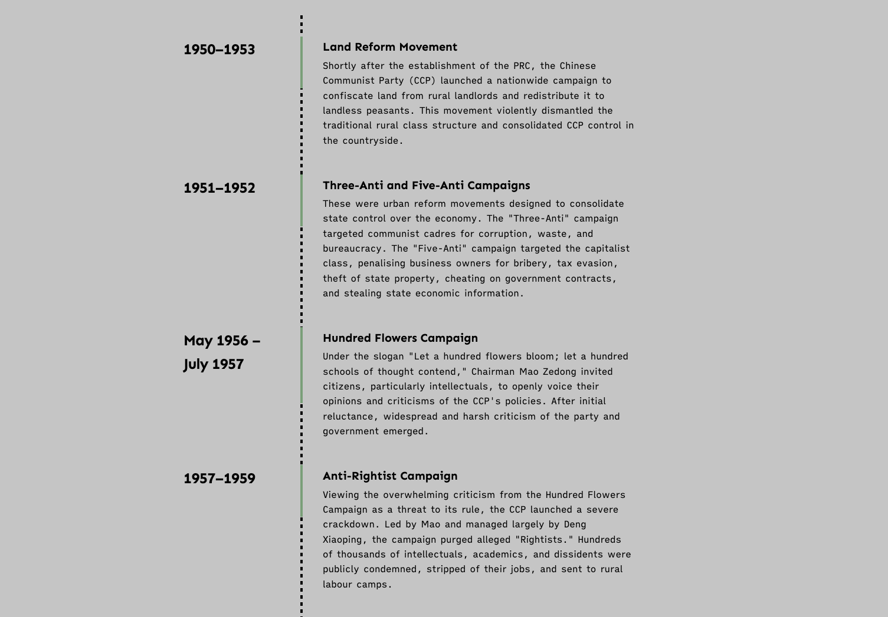

* **Dates** sit in bold in a column on the left, each with a dot on the line. The dots use your preset's accent colour.
* **Titles** are bold, and **descriptions** are a little smaller, in the secondary text colour.
* **Hovering** over a date highlights the whole event and enlarges its dot.
* **When the note opens,** titles and descriptions slide gently into place (unless your system asks for reduced motion, see [§19](#19-reduced-motion)).
* The timeline is at most 800px wide and centred. On phones it becomes a single column, with the line running down the left.
* Blank lines between events are fine, as long as everything stays in one list. A heading or paragraph in between starts a new timeline.
* Stick to exactly three bullets per event: a missing or extra bullet shifts every event after it.
* Timelines appear in reading view.

## 11. Callouts

Brutalist gives callouts a hard edge: a 4px bar down the left in the callout's colour, a soft tint of the same colour behind the text, and the title and icon in that colour too. Quotes are the exception, with the bar but no tint.

```markdown
> [!tip] Keep it short
> A title and a line or two is usually all a callout needs.

> [!warning]- Folded by default
> Put a minus after the type to fold a callout; a plus makes it foldable but open.
```

Callout types share their colours in families:

| Colour family | Types |
| :--- | :--- |
| Note | `note` |
| Info | `info` |
| Abstract | `abstract`, `summary`, `tldr` |
| Tip | `tip`, `hint`, `important`, `success`, `check`, `done` |
| Warning | `warning`, `caution`, `attention`, `question`, `help`, `faq`, `todo` |
| Failure | `failure`, `fail`, `missing`, `danger`, `error`, `bug` |
| Example | `example` |
| Quote | `quote`, `cite` (bar only, no tint) |
| Anything else | A neutral tone, so you can invent your own types |

**The colours change with your preset:**

* On **Asphalt** they're muted (slate blue, teal, sage green, ochre, brick red, plum and grey) so they sit quietly on a grey page.
* On **every other preset** each family starts from a clear hue (blue for note and info, then cyan, green, amber, red, violet and grey), blended with the text colour so that every title and every line of body text reaches a contrast of 4.5:1 or better on its tinted background. In dark mode the tint is lighter, to keep body text crisp.

In a dashboard, callouts become cards and drop their colours ([§8](#8-dashboards)). In PDF exports they use Asphalt's light-mode colours, which are made for pale paper ([§18](#18-print-and-pdf-export)).

## 12. Alternative Tasks

Obsidian only knows two kinds of task, open and done, and it draws any other character between the brackets as done. Brutalist adds four more that you can tell apart at a glance:

| Write | Meaning | How it looks |
| :--- | :--- | :--- |
| `- [ ]` | Open | A plain square |
| `- [x]` | Done | A solid square, with the text struck through |
| `- [>]` | Forwarded or rescheduled | A solid square with `>` in it |
| `- [!]` | Important | A solid square with `!` in it |
| `- [?]` | Question | A solid square with `?` in it |
| `- [-]` | Cancelled | A solid square with `–` in it, with the text struck through |

```markdown
- [ ] Write the introduction
- [x] Collect the sources
- [>] Review chapter two (moved to next week)
- [!] Send the contract today
- [?] Check whether the deadline has moved
- [-] Draft the old appendix
```

* The symbol is drawn in the page colour, so it stands out from the square just as clearly in every mode and preset.
* They work in reading view and in Live Preview, including in nested lists.
* Clicking a checkbox still only switches between open and done, so type the character between the brackets yourself.
* Any other character, such as `- [/]`, shows as a plain solid square.

## 13. Mermaid Diagrams

### 13.1 What Mermaid is

Mermaid lets you draw diagrams by writing text. You describe the boxes and arrows in a few short lines, and Obsidian draws the picture for you. It's built into Obsidian, so there's no plugin to install, and because the diagram is plain text inside your note, it stays searchable, easy to edit and future-proof.

Brutalist redraws every diagram in your theme's colours, so diagrams look like part of the page rather than a picture pasted onto it, in light mode, dark mode and every preset.

### 13.2 Your first diagram

1. On a new line, type three backticks followed by the word `mermaid`.
2. Write the diagram on the lines below.
3. Close the block with three more backticks.

````markdown
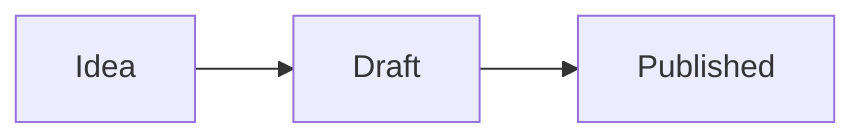
```mermaid
flowchart LR
  A[Idea] --> B[Draft]
  B --> C[Published]
```
````

This draws three boxes from left to right, *Idea*, *Draft* and *Published*, joined by arrows.

* In **reading view**, the diagram appears straight away.
* In **Live Preview**, it appears as soon as your cursor leaves the block. To edit it again, hover over the diagram and click the `</>` button in its top-right corner, or move into it with the arrow keys.
* The first diagram of a session can take a second or two to appear, because Obsidian only loads Mermaid when a note needs it.

Indenting the lines inside the block is optional, but it makes longer diagrams much easier to read.

### 13.3 Flowcharts

The first line sets the direction:

| First line | Direction |
| :--- | :--- |
| `flowchart TD` or `flowchart TB` | Top to bottom |
| `flowchart LR` | Left to right |
| `flowchart RL` | Right to left |
| `flowchart BT` | Bottom to top |

**Boxes.** Each box has a short ID, which you use to connect it, followed by its label. The brackets around the label choose the shape:

| Write | Shape |
| :--- | :--- |
| `A[Text]` | Rectangle |
| `A(Text)` | Rounded rectangle |
| `A([Text])` | Pill |
| `A((Text))` | Circle |
| `A{Text}` | Diamond, for decisions |
| `A{{Text}}` | Hexagon |
| `A[(Text)]` | Cylinder, for databases |

**Connections.**

| Write | Draws |
| :--- | :--- |
| `A --> B` | An arrow |
| `A --- B` | A line with no arrowhead |
| `A -.-> B` | A dotted arrow |
| `A ==> B` | A thick arrow |
| `A -->|Yes| B` | An arrow with a label |
| `A -- Yes --> B` | The same labelled arrow, written another way |

**Groups.** Wrap boxes in `subgraph Title` … `end` to draw a frame around them.

Putting it all together:

````markdown
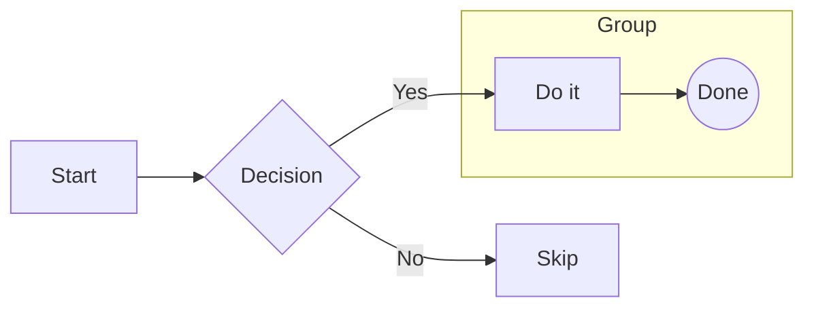
```mermaid
flowchart LR
  A[Start] --> B{Decision}
  B -->|Yes| C[Do it]
  B -->|No| D[Skip]
  subgraph Group
    C --> E((Done))
  end
```
````

Reading it line by line: the chart runs left to right; *Start* leads to a *Decision* diamond; the *Yes* arrow goes to *Do it* and the *No* arrow to *Skip*; and *Do it* sits with the circle *Done* inside a frame called *Group*.

**Linking boxes to notes.** Obsidian can turn boxes into links to your notes. Name the boxes after the notes and add a line starting with `class`, listing them and ending in `internal-link;`:

````markdown
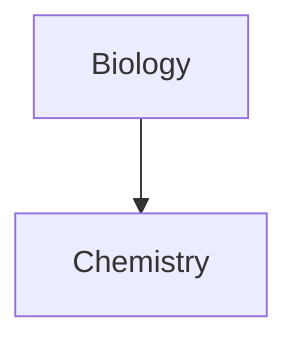
```mermaid
flowchart TD
  Biology --> Chemistry
  class Biology,Chemistry internal-link;
```
````

Clicking *Biology* then opens your note called Biology.

### 13.4 Sequence diagrams

A sequence diagram shows messages passing between people or systems over time, from top to bottom:

````markdown
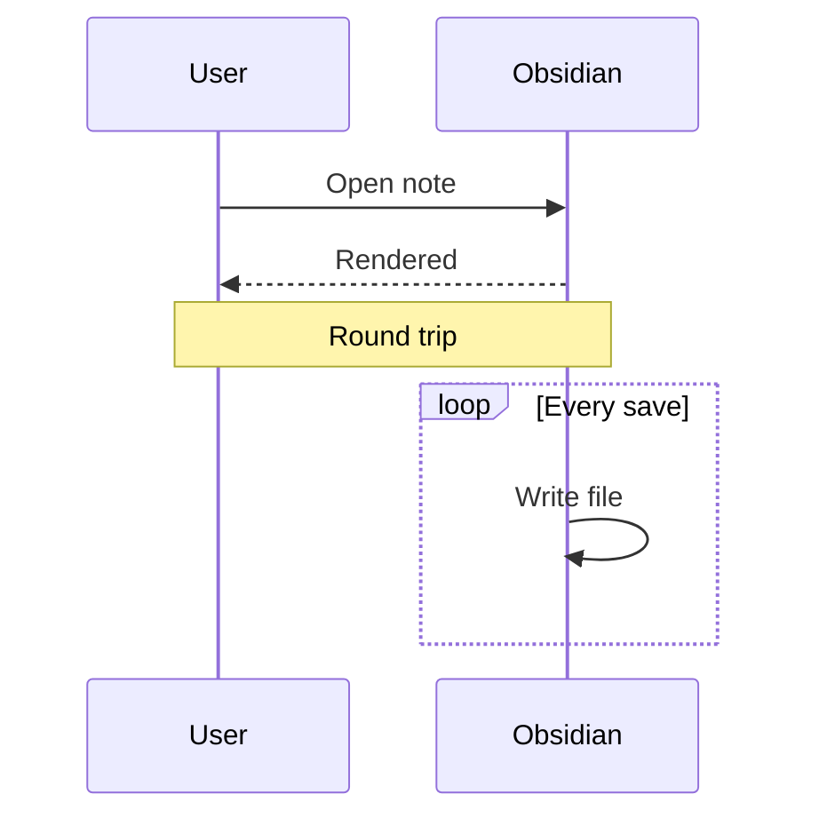
```mermaid
sequenceDiagram
  participant U as User
  participant O as Obsidian
  U->>O: Open note
  O-->>U: Rendered
  Note over U,O: Round trip
  loop Every save
    O->>O: Write file
  end
```
````

* `participant U as User` adds a participant with a short ID (`U`) and the name to show (`User`).
* `->>` draws a solid arrow, usually a request, and `-->>` a dashed arrow, usually a reply. The text after the colon is the message.
* `Note over U,O: …` places a note across both participants; `Note right of U: …` puts one beside a single participant.
* `loop Label` … `end` marks steps that repeat. `alt Label` … `else Label` … `end` shows alternatives, and `opt Label` … `end` an optional step.

### 13.5 Class diagrams

A class diagram describes things and how they relate. It's handy for software, but just as useful for ideas, concepts or organisations:

````markdown
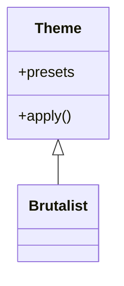
```mermaid
classDiagram
  class Theme {
    +presets
    +apply()
  }
  Theme <|-- Brutalist
```
````

* `class Theme { … }` defines a class and its members; a member ending in `()` is a method.
* `+` marks a member as public, `-` as private and `#` as protected.
* Relationships: `<|--` inheritance, `*--` composition, `o--` aggregation, `-->` association and `..>` dependency.

### 13.6 State diagrams

A state diagram shows the stages something moves through, such as a document on its way to publication:

````markdown
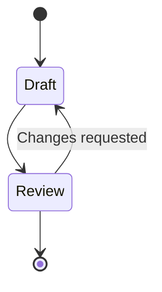
```mermaid
stateDiagram-v2
  [*] --> Draft
  Draft --> Review
  Review --> Draft : Changes requested
  Review --> [*]
```
````

* `[*]` is the start when it's on the left of an arrow, and the end when it's on the right.
* `A --> B` is a transition, and any text after a colon labels it.

### 13.7 Other diagram types

Obsidian's Mermaid can also draw pie charts, Gantt charts, user journeys, mind maps, timelines, entity-relationship diagrams, Git graphs and more. For example:

````markdown
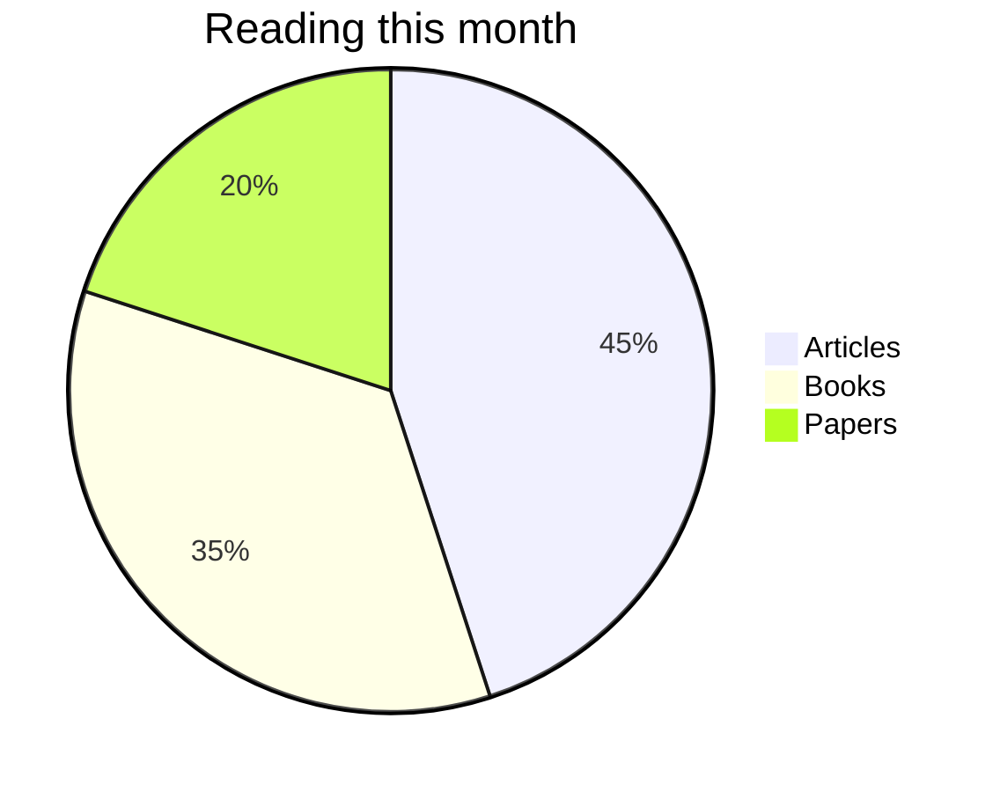
```mermaid
pie title Reading this month
  "Articles" : 45
  "Books" : 35
  "Papers" : 20
```
````

These work too. Brutalist gives their text the theme's colour and leaves Mermaid's own fills in place. You'll find the full syntax for every type in the [Mermaid documentation](https://mermaid.js.org/intro/).

### 13.8 How Brutalist draws diagrams

In flowcharts, sequence, class and state diagrams:

* **Shapes** (boxes, circles, diamonds, participants, classes and states) are filled with the surface colour and outlined in the text colour, and rectangles get square corners.
* **Groups and notes** use the sidebar colour with a softer outline.
* **Lines and arrowheads** use the UI font colour, a step quieter than the shapes.
* **Labels** are in the body text colour. Labels on arrows sit on a patch of page colour, so lines never run through the words.
* **Start and end dots** in state diagrams stay solid.
* **Dark mode:** Obsidian normally inverts diagram colours in dark mode. Brutalist switches that off and draws diagrams in its own dark palette instead.
* **Presets:** diagrams follow your preset automatically.
* **PDF export:** diagrams print in black and light grey on white ([§18](#18-print-and-pdf-export)).

### 13.9 Tips and troubleshooting

* **An error instead of a diagram** means Mermaid couldn't understand a line. The usual culprits are a missing `end`, a misspelt diagram type on the first line, or brackets and other symbols inside a label. Wrap labels like that in quotes: `A["Budget (draft)"]`.
* **Try ideas in the [Mermaid Live Editor](https://mermaid.live)**, which points out mistakes as you type, then paste the result into your note.
* **Comments:** lines starting with `%%` are ignored, so you can leave yourself notes inside a diagram.
* **Wide diagrams:** Obsidian draws diagrams at their natural size, so a long left-to-right flowchart can run past the edge of the note. Switch it to `TD`, shorten the labels, or give the note a wider width class.
* **Your own colours:** because Brutalist colours diagrams itself, colours set with `style`, `classDef` or an `%%{init: …}%%` line may be overridden on the parts the theme styles.

## 14. Embedded Notes

Embedding pulls a note, or part of one, into another note:

```markdown
![[Meeting notes]]
![[Meeting notes#Decisions]]
![[Meeting notes#^key-point]]
```

The first line embeds a whole note, the second a single section and the third a single block.

Brutalist frames embeds with a 4px bar in the text colour down the left and a band of the surface colour behind, so borrowed text is easy to tell apart from your own. Embeds look the same in reading view and in Live Preview. Tables inside an embed switch their cells to the page colour, so their grid still shows against the band. In PDF exports, embeds get a thinner black bar and no background.

## 15. Image Captions

Brutalist shows an image's caption underneath it: centred, slightly smaller and in the interface font. Write the caption after a pipe:

```markdown
![[harbour.jpg|The harbour at dawn]]
```

The Markdown image syntax works as well, with the caption in the square brackets:

```markdown

```

Captions appear in reading view, for images stored in your vault.

> [!NOTE]
> When you embed an image without a caption, Obsidian uses the file name as its alternative text, so the file name appears as the caption. Inside an [image grid](#9-image-grid), file-name captions are hidden automatically.

## 16. Tables and Bases

**Tables** have no lines at all. Every cell is filled with the surface colour and separated from its neighbours by a 1px gap of page colour, so the grid appears from the gaps alone. Header text uses the UI font colour, and on desktop tables stretch to the full width of the note. Checkboxes inside a table get a background that stands out from the cell.

* Inside an embedded note, cells use the page colour so the grid still shows against the embed's background.
* In PDF exports, tables are ruled with thin black lines instead ([§18](#18-print-and-pdf-export)).

**Bases** share the same look. Table views use filled cells with page-coloured gaps, a focused cell is outlined in the text colour, card views sit on the sidebar colour, and toolbar buttons use the UI font colour with a surface-coloured hover. Tags and list values appear as pills in the tag style ([§17](#17-tags-links-and-the-interface)).

## 17. Tags, Links and the Interface

### Tags and pills

* Tags are square and borderless, set in the interface font on a light tint.
* On **Asphalt** they're neutral; on **every other preset** they take the accent colour.
* On desktop, a tag fills with the accent colour when you hover over it.
* Pills in the Properties panel and in Bases, such as tags, aliases and list values, look the same. Pills that are links keep their link colour.

### Links

* **Internal links** are underlined, in the internal link colour. Hovering turns them darker in light mode and lighter in dark mode.
* **External links** have a colour of their own, so you can tell at a glance which links leave your vault.
* **Unresolved links**, to notes that don't exist yet, have a dashed underline and are slightly faded.
* **Footnote references** are small, and only underlined when you hover over them.

Link colours are covered in [§4.2](#42-font-and-link-colours).

### Writing

* **Blockquotes** have a 4px bar in a faint UI colour, and slightly smaller text.
* **Horizontal rules** (`---`) are a thin line in the UI font colour.
* **List bullets and numbers** are bold.
* **Code** uses the monospace font on your preset's code background, with square corners.
* **Highlights** (`==text==`) and **selected text** use your preset's colours.
* **Checkboxes** are plain squares with no border, and done tasks are filled solid, without a tick.

### The interface

* **Square everywhere:** menus, modals, the command palette, buttons, text fields, tabs, callouts, code blocks and scrollbars all have square corners, and most have no border. Toggle switches keep a round knob on a square track.
* **Toggles and sliders** use the accent colour.
* **Scrollbars** are slim (8px) and square, and are hidden while your pointer is outside the window. On every preset except Asphalt they're tinted with the accent.
* **Tabs:** the active tab merges into the page, while the others sit on the sidebar colour.
* **Buttons** are flat. The main button in a dialog is shown in reverse, and buttons that delete something or call for care are solid red with white text, so they're hard to press by accident.
* **Settings icon:** a custom icon replaces the standard gear, in the ribbon and in the mobile drawer.
* **Help button:** hidden from the ribbon and the vault menu, to keep them tidy.
* **File explorer:** folders are marked with fold bars, and open branches hang from an accent guide line (see below).
* **Graph view and Canvas** draw their lines, nodes and cards in the theme's colours.
* **Menus** on desktop use the surface colour.
* **Status bar:** items sit on the page colour and highlight when you hover over them.
* **New tab page:** its actions are square buttons on the sidebar colour, in the interface font, with the hover colour laid over them.
* **Calendar plugin:** today's date is bold (orange in dark mode and red in light mode on Asphalt, the accent colour on other presets), and days with notes are marked with a dot.

### Fold bars

Brutalist has no chevrons. Everything that opens and closes is marked with a bar instead: thin in the guide colour while closed, thick in your preset's accent colour while open.

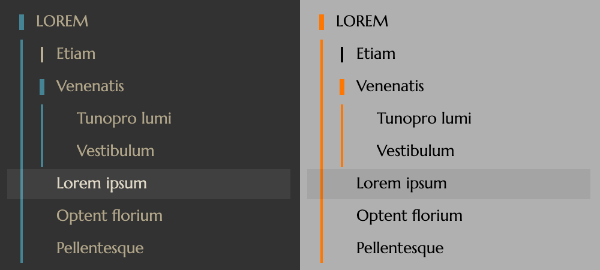

* **Folders and every other tree** (bookmarks, outline, tags, search results and backlinks): an open folder's bar leads into a 2px guide line in the accent colour, so you can trace each open branch.
* **Headings, lists, callouts, the Properties panel and HTML `<details>`** fold with the same bar.
* **Menus and pickers:** the vault switcher, the tab list, submenus, navigable rows in Settings and the Bases views menu show a thin bar that thickens in the accent when you point at it or open its menu.
* **Collapse all:** the button above the file explorer shows a thick bar while any folder is open.
* **Dropdowns** end in a bar instead of an arrow.

## 18. Print and PDF Export

To export a note, open its **More options** menu (the three dots at the top right) and choose **Export to PDF**, or run **Export to PDF** from the command palette.

Brutalist prepares the page for paper, whatever mode or preset you use on screen:

* **Black text on white paper**, so there are no dark or coloured pages wasting ink.
* **Links, headings, list markers and tags** are black, and tags lose their tint.
* **Highlights** turn pale yellow, and **code blocks** light grey.
* **Tables** get thin black rules, a heavier line under the header row and bold header text.
* **Unchecked checkboxes** are drawn as outlines, so they don't vanish on white.
* **Callouts** keep their colours, using Asphalt's light-mode palette, which is made for pale backgrounds.
* **Embedded notes** get a black bar and no background.
* **Mermaid diagrams** print in black and light grey.
* **Page breaks:** headings stay with the text that follows them, and code blocks, quotes, tables, callouts, images, diagrams and embeds aren't split across pages when they fit on one.
* **Dashboards** leave out the banner, and each card gets a thin black outline.
* **Numbered headings** are numbered correctly all the way through, even in very long notes.
* **Image grids** print as grids.

## 19. Reduced Motion

Brutalist uses a little movement: cards and buttons respond to hover, toggles slide, the ribbon opens and timeline events glide into place. If you've asked your system to reduce motion, all of that, and Obsidian's own animations too, finishes instantly instead. There's nothing to switch on in Obsidian, because the theme follows your system setting:

* **macOS:** System Settings › Accessibility › Display › Reduce motion
* **Windows:** Settings › Accessibility › Visual effects › Animation effects (turn it off)
* **iOS and iPadOS:** Settings › Accessibility › Motion › Reduce Motion
* **Android:** Settings › Accessibility › Remove animations (the exact place varies between devices)

## 20. Mobile

Brutalist has its own settings for Obsidian on phones and tablets, in **Style Settings › Mobile Settings**. The **drawer** is the side panel that slides in from the edge of the screen, and the **navigation bar** is the floating toolbar at the bottom.

| Setting | Options | Default |
| :--- | :--- | :--- |
| **Drawer Color** (light and dark mode) | Any colour | Follows the preset: its sidebar colour in light mode, its page colour in dark mode |
| **Nav Bar Color** (light and dark mode) | Any colour | Follows the preset's sidebar colour |
| **Nav Bar Opacity** (light and dark mode) | 0 to 1 | 0.7 |
| **Nav Bar Border Thickness** (light and dark mode) | 0 to 10px | 0px |
| **Nav Bar Border Style** (light and dark mode) | Solid, none, dashed or dotted | Solid |
| **Nav Bar Border Color** (light and dark mode) | Any colour | Follows the preset's sidebar colour |
| **Nav Bar Radius** (both modes) | 0 to 30px | 20px |

Until you change them, the colour pickers display Asphalt's greys, but the drawer and navigation bar actually follow whichever preset you've chosen. In dark mode the navigation bar also blurs whatever is behind it, for a frosted look.

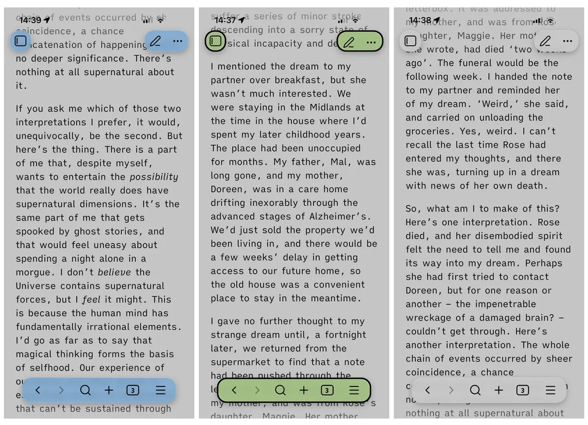
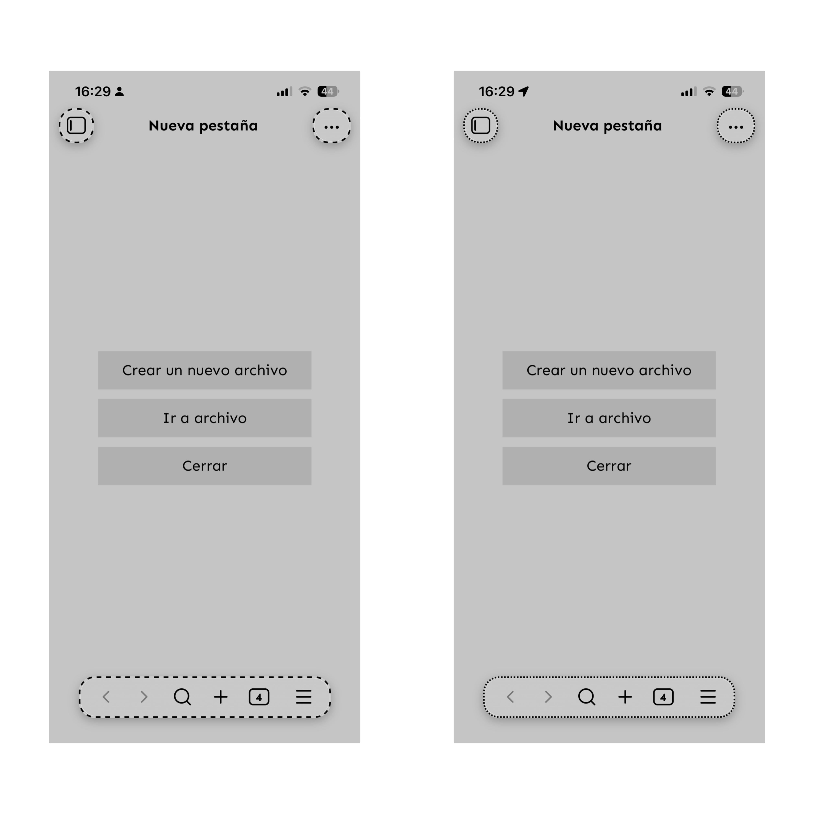

A few other things are different on mobile:

* Menus, settings, the command palette and dialogs all have square corners.
* Tooltips are hidden.
* Dashboards drop the banner and show fewer columns, and timelines become a single column.
* On narrow phones, side panels open to the full width of the screen.
* Auto-hide Side Ribbon only applies on desktop.

## 21. Fine-Tuning with CSS Snippets

A few measurements have no Style Settings control, but they're easy to change with a CSS snippet:

1. Open **Settings › Appearance** and scroll down to **CSS snippets**.
2. Click the folder icon to open the snippets folder, and create a file there called, for example, `brutalist-tweaks.css`.
3. Paste in any of the examples below and adjust the values.
4. Back in Obsidian, click the refresh icon next to **CSS snippets** and switch your snippet on.

```css
/* Image grid: wider columns (default 180px) */
html body.obsidian-app .markdown-preview-view.img-grid {
  --img-grid-col-width: 240px;
}

/* Timeline: date column, space between events, dot size and colour */
html body.obsidian-app .markdown-preview-view.custom-timeline {
  --tl-date-width: 140px;              /* default 200px */
  --tl-row-gap: 1.5rem;                /* default 2.5rem */
  --tl-dot-size: 0.9rem;               /* default 1.2rem */
  --tl-dot-color: var(--text-muted);   /* default: the preset's accent */
}

/* Fold bars: widths, height and the open colour */
html body.obsidian-app {
  --fold-bar-width: 3px;                       /* closed, default 2px */
  --fold-bar-width-open: 5px;                  /* open, default 4px */
  --fold-bar-height: 14px;                     /* default 13px */
  --fold-bar-color-open: var(--text-accent);   /* default: the preset's accent */
  --nav-guide-border-width-open: 1px;          /* open branch line, default 2px */
}

/* Tables: a wider gap between cells (default 1px) */
html body.obsidian-app {
  --table-grid-gap: 2px;
}
```

Snippets are applied after the theme, so these take effect straight away and carry over when the theme updates.

## 22. Known Limitations

* **Numbered headings** restart far down very long notes on screen, because Obsidian unloads the parts of a note that are out of view. PDF exports are always numbered correctly ([§6.2](#62-numbered-headings)).
* **Image grids** only form in reading view and PDF export, not in Live Preview.
* **Dashboards** show a single column in Live Preview, and banners are desktop-only.
* **Mermaid:** flowcharts, sequence, class and state diagrams are fully themed, while other diagram types keep Mermaid's own fills. Very wide diagrams can run past the edge of the note.
* **Amber** overrides the font and link colour pickers while it's selected.
* **Asphalt's callouts** are deliberately muted, so their titles have less contrast than on the other presets.
* **Images without a caption** show their file name underneath, except inside an image grid.
* **Task characters** other than the four in [§12](#12-alternative-tasks) look like a done task.
* **Note Width and the width classes** only apply while Readable line length is on, with the exception of dashboards.

## 23. Gallery

### Dark mode
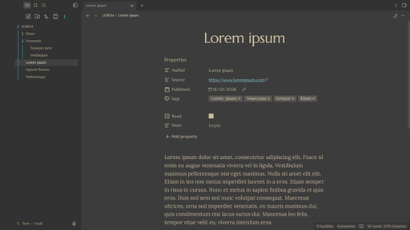

### Light mode
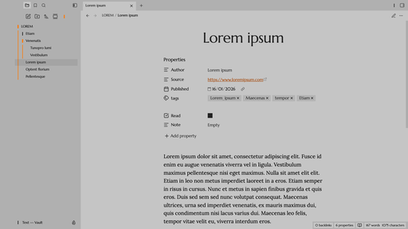

## 24. Quick Reference

### All classes

| Class | Effect | See |
| :--- | :--- | :--- |
| `dashboard` | Callouts become a board of cards | [§8](#8-dashboards) |
| `img-grid` | Images on consecutive lines form a grid | [§9](#9-image-grid) |
| `custom-timeline` | A list of dates, titles and descriptions becomes a timeline | [§10](#10-timelines) |
| `hide-all` | Hides the properties and the inline title | [§7](#7-per-note-classes) |
| `width-800` | Note width of 800px | [§7](#7-per-note-classes) |
| `width-900` | Note width of 900px | [§7](#7-per-note-classes) |
| `width-1000` | Note width of 1000px | [§7](#7-per-note-classes) |
| `width-1200` | Note width of 1200px | [§7](#7-per-note-classes) |
| `width-1600` | Note width of 1600px | [§7](#7-per-note-classes) |
| `full-width` | The note fills the pane | [§7](#7-per-note-classes) |

### Handy syntax

| Write | You get | See |
| :--- | :--- | :--- |
| `> [!banner]` with `> ![[image.jpg]]` on the next line | A dashboard banner | [§8.5](#85-banner) |
| `- [>]`, `- [!]`, `- [?]`, `- [-]` | Forwarded, important, question and cancelled tasks | [§12](#12-alternative-tasks) |
| `![[image.jpg\|Caption]]` | An image with a caption | [§15](#15-image-captions) |
| A code block with `mermaid` after the opening backticks | A diagram | [§13](#13-mermaid-diagrams) |
| `![[Note#Heading]]` | An embedded section | [§14](#14-embedded-notes) |

## 25. Credits and Support

* The colour presets use the palettes of **Aubade**, a sibling theme by the same author.
* Found a bug or have an idea? [Open an issue](https://github.com/DuckTapeKiller/Brutalist/issues).
* If Brutalist makes your vault a nicer place to be, you can [support it on Ko-fi](https://ko-fi.com/ducktapekiller).

_This theme is a perpetual work in progress._

Created by **DuckTapeKiller**
